# 南理工助手-小程序版

> 这是一个主要服务南京理工大学师生的一个综合工具类微信小程序 
> 欢迎各位同学参与到开发维护中来

## 小程序体验
微信搜索：MTR南理 
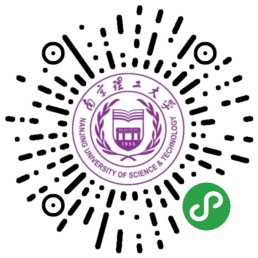

## 代码结构
njustapp：前端代码 

## 功能概要

- [x] 课程表
  - [x] 课程展示
  - [x] 今日课程
  - [x] 课程日期
- [x] 成绩查询
  - [x] 成绩展示
  - [x] 绩点计算(所有课程)
  - [x] 可选课程进行计算
- [x] 考试查询
- [x] 图书馆
  - [x] 图书搜索
  - [x] 我的借阅
  - [ ] 续借
- [x] 空闲/自习教室
- [x] 校历(教务处的校历图片)
<!-- - [ ] 寻物/寻卡(失物招领,并且针对校园卡单独分类) -->

## 预览
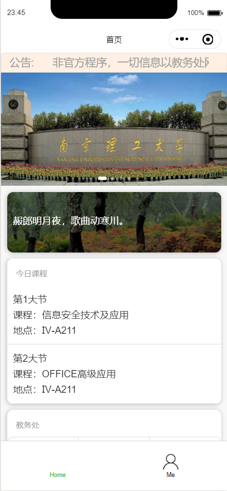
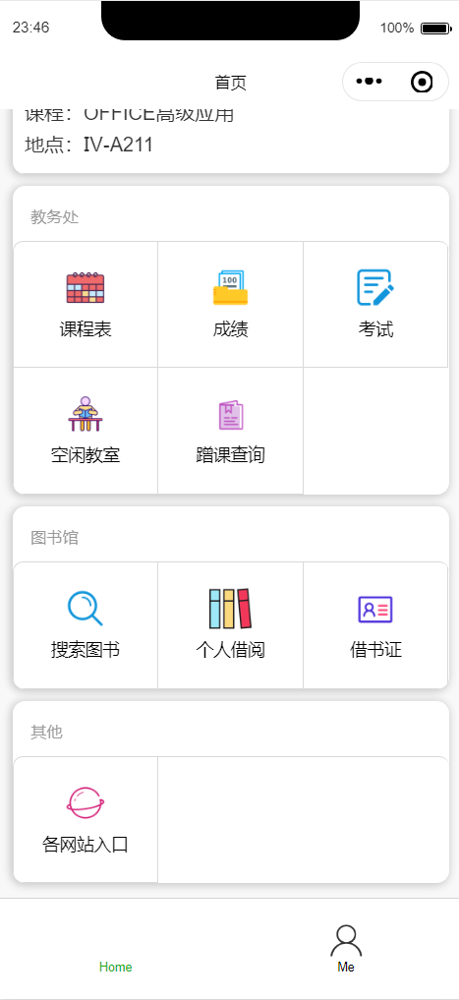
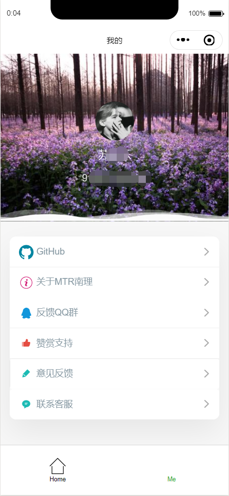
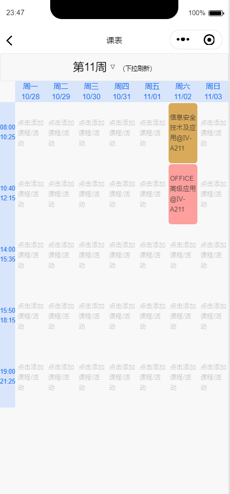
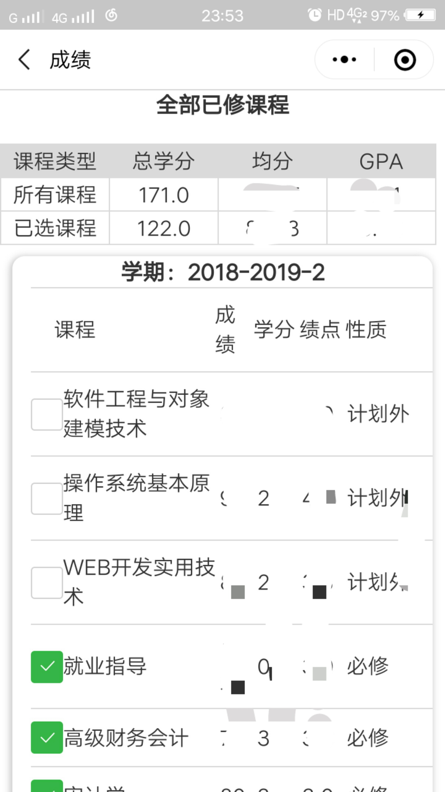
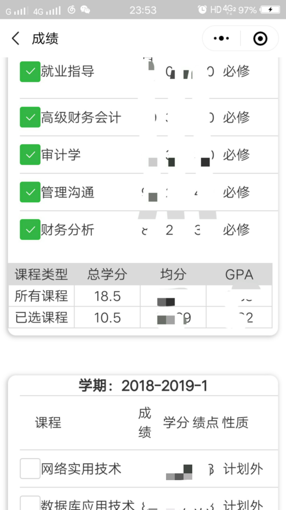
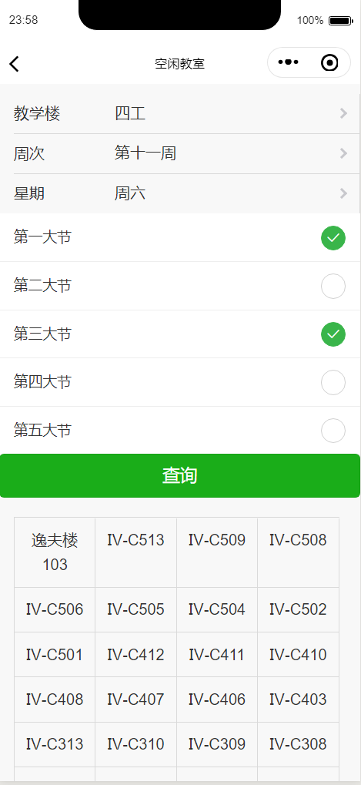
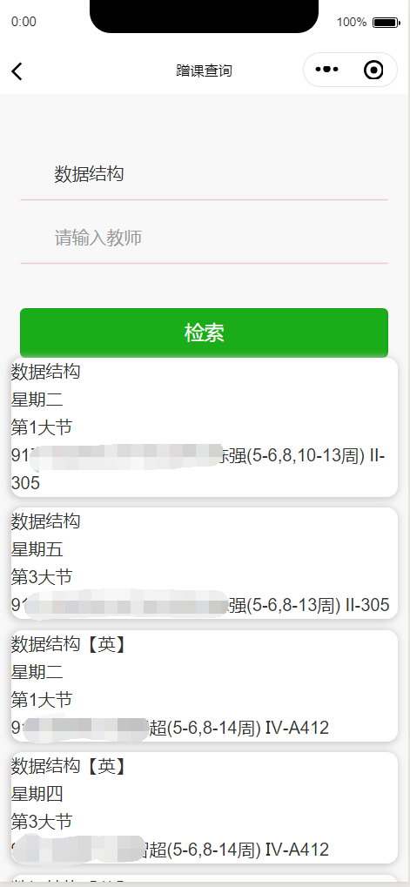
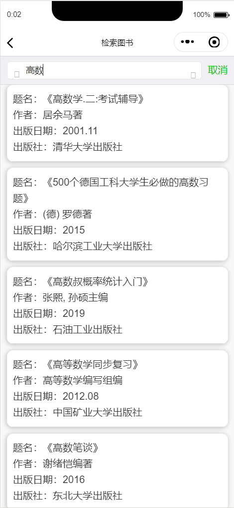
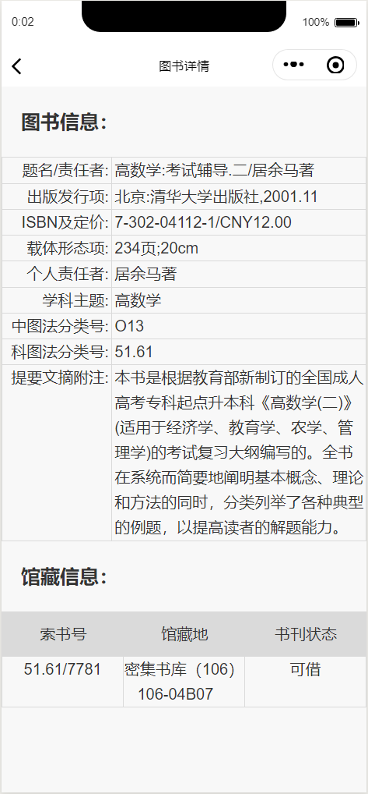
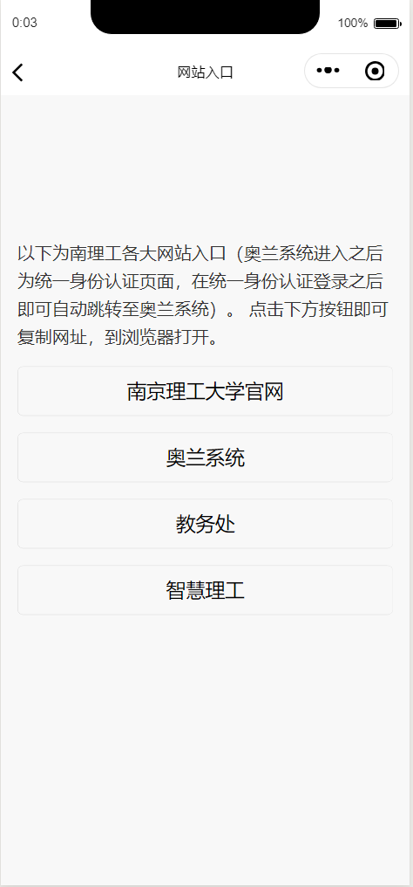
